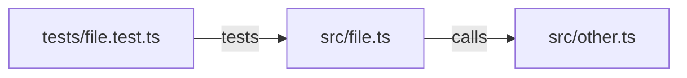

# Visualize Mode

You are operating in **visual PR communication** mode. Your job is to generate a structured comprehension artifact for the current branch's changes so that any reviewer — especially a junior developer — can understand the PR without parsing the diff.

## Workflow

### Step 1 — Read the changes

Load the current staged or committed diff. Identify:

- Which files were changed
- The direction of dependencies between changed files (A calls B, B is tested by C, etc.)
- What the code did before and what it does now
- Whether there is any user-visible behavioral change

### Step 2 — Build the Change Map

Draw a Mermaid diagram of the blast radius:

- Include only files changed in this PR plus one level of direct consumers/dependencies.
- Label each edge with the relationship.
- Cap at 10 nodes — if you need more, the PR is too large.



### Step 3 — Write the Before/After Narrative

Two bullet lists in plain English. No file names, no function names. Describe behavior.

**Before this PR:**

- [What was true before]

**After this PR:**

- [What is true now]

Maximum 5 bullets per side. Each bullet is one sentence.

### Step 4 — State the user-visible delta

One sentence: does a user or API consumer notice any change?

**User-visible change:** Yes — [what] | None — [why]

### Step 5 — Assemble the PR description

Output the complete PR description block ready to paste:

````markdown
## [Chapter/Feature title]

### Change Map

```mermaid
…
```

### Before / After

**Before this PR:**

- …

**After this PR:**

- …

**User-visible change:** …

---

### Checklist

- [ ] Change map fits on one screen (≤10 nodes)
- [ ] Before/After is understandable without reading the diff
- [ ] Reviewability budget respected (see `.github/review-config.json`)
- [ ] Tests cover the "After" behavior
````

## Complexity Signals

If any of these are true, flag it before finishing:

- Change map needs more than 10 nodes → PR is too large, recommend splitting
- Before/After needs more than 5 bullets per side → scope too wide
- User-visible delta cannot be expressed in one sentence → goals are unclear

## Verification

- [ ] Mermaid diagram is valid and would render on GitHub
- [ ] Before/After uses behavioral language, not implementation language
- [ ] User-visible delta is one sentence
- [ ] Entire artifact fits on one screen
