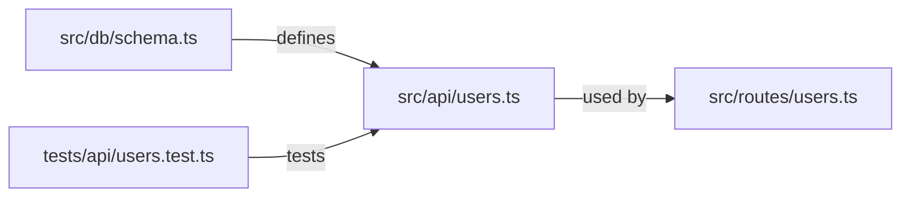

# Visual PR Communication

## Overview

Every PR description is a communication document, not a changelog. Before a reviewer touches the diff, they should be able to answer: what changed, why, and what is different about the world now? Generate a structured, visual comprehension artifact as part of every PR description.

## When to Use

- Opening any chapter branch PR (required)
- Opening any story-to-main PR (required — adapt for multi-chapter scope)
- Any time you want a reviewer to understand a change faster

## The Three-Part Artifact

### 1. Change Map (Mermaid diagram)

Show the blast radius — which files were touched and how they relate. Not a full call graph. Just enough for a reviewer to understand the shape of the change.



Rules:
- Show only files changed in this PR, plus one level of direct consumers/dependencies.
- Label edges with the relationship (`defines`, `used by`, `tests`, `extends`, `calls`).
- Cap at 10 nodes. If the change map would exceed 10 nodes, the PR is too large — split it.
- Use `graph LR` (left-to-right) for most changes; `graph TD` (top-down) for layered architectures.

### 2. Before / After Narrative

Two short plain-English bullet lists. Written for a developer who has never read this codebase.

```markdown
**Before this PR:**
- The `users` table had no `email` column.
- Creating a user required only a display name.
- The POST /users endpoint returned a 201 with no body.

**After this PR:**
- The `users` table has a required, unique `email` column.
- Creating a user requires both a display name and an email address.
- The POST /users endpoint returns the created user object.
```

Rules:
- Maximum 5 bullets per side.
- No jargon, no file names, no function names — describe behavior, not implementation.
- Each bullet is one sentence.
- If you can't write a "Before" bullet for every "After" bullet, the change has no clear baseline — stop and clarify scope.

### 3. User-Visible Delta

One sentence. Does this PR produce any change a user (or an API consumer) would notice?

```markdown
**User-visible change:** Yes — users must now supply an email address when registering.
```

or

```markdown
**User-visible change:** None — this is an internal refactor with no behavioral change.
```

## PR Description Template

Use this template for every chapter PR:

```markdown
## [Chapter N: Short Title]

### Change Map

```mermaid
graph LR
  …
```

### Before / After

**Before this PR:**
- …

**After this PR:**
- …

**User-visible change:** [Yes — description | None — reason]

---

### Checklist
- [ ] Change map fits on one screen (≤10 nodes)
- [ ] Before/After is understandable without reading the diff
- [ ] Reviewability budget respected (see `.github/review-config.json`)
- [ ] Tests cover the "After" behavior
```

## Complexity Signal

The visual artifact is a **canary**:

| Symptom | Diagnosis | Action |
|---|---|---|
| Change map exceeds 10 nodes | PR is too large | Split into two chapters |
| Before/After needs more than 5 bullets | Scope is too wide | Split into two chapters |
| Can't write a user-visible delta in one sentence | Goals are unclear | Stop and clarify with the human |
| Before/After reads like implementation notes | Written at wrong level | Rewrite in behavioral terms |

## Verification

Before pushing the branch:

- [ ] PR description uses the three-part template
- [ ] Mermaid diagram renders (paste into a GitHub preview or VS Code Mermaid extension)
- [ ] Before/After is written in plain English for a junior-developer audience
- [ ] User-visible delta is one sentence
- [ ] The whole artifact fits on one screen
