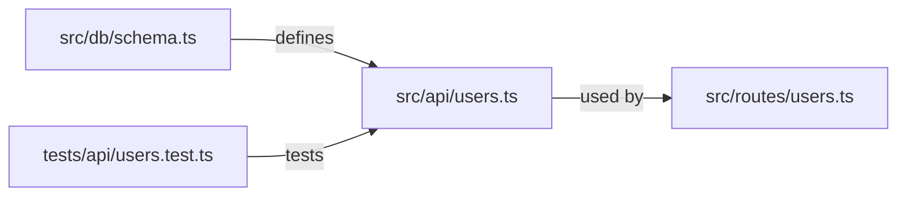

# Visual PR Communication

## Overview

Every PR description is a communication document, not a changelog. Before a reviewer touches the diff, they should be able to answer: what changed, why, and what is different about the world now? Generate a structured, visual comprehension artifact as part of every PR description.

## Human Cognition — Why This Works

These rules are grounded in how the human brain actually processes unfamiliar code during review.

**Schema activation (Bartlett, 1932; Rumelhart, 1980).** Reviewers can only make sense of new information by mapping it onto what they already know. The "Before" bullets exist to activate that prior mental model _before_ the change is introduced. Without them, the reviewer must reconstruct context from the diff itself — slow, error-prone, and the primary cause of review fatigue.

**Dual coding (Paivio, 1971; Mayer, 2009).** The brain processes visual/spatial and verbal/linguistic information through two independent channels. Pairing the change map (visual) with the Before/After narrative (verbal) encodes the change in both channels simultaneously — comprehension is faster and retention is higher than with either channel alone. A diagram without a narrative, or a narrative without a diagram, is measurably weaker than both together.

**Cognitive load (Sweller, 1988).** Working memory is finite. Every concept a reviewer must hold in mind while reading code adds _extraneous_ cognitive load — effort that doesn't contribute to understanding the change. The PR description's job is to offload that extraneous load so the reviewer's limited working memory is free for the actual diff.

**Working memory limits (Miller, 1956).** Humans hold roughly 7 ± 2 chunks of information in working memory at a time. The 10-node cap on the change map and the 5-bullet cap on Before/After are not style preferences — they keep the artifact within working memory capacity. Exceeding those limits forces the reviewer to mentally paginate, and pagination is where subtle bugs get missed.

**Primacy effect (serial position effect).** Information encountered first is disproportionately rehearsed and encoded. The change map goes first so its spatial layout anchors the reviewer's mental model throughout the entire review session — even when they are reading line 200 of the diff.

**BLUF — bottom line up front (speech communication).** State the most important fact before asking the audience to process supporting detail. The entire three-part artifact applies this principle at the PR level: the reviewer gets context, motivation, and scope _before_ they open the diff. Without the artifact, reviewers must derive all of that by reading code bottom-up — the reverse of how humans efficiently process information.

## Why This Matters After Merge

The three-part artifact is optimized for the _immediate_ review session — the day the PR is opened. But code outlives reviews. Six months later, a junior developer onboarding, or the original author returning after context decay, needs the same cognitive scaffolding.

**Spacing effects (Cepeda et al., 2006).** Humans retain information better when they encounter it multiple times over days and weeks. A code change encountered once during review leaves a weaker trace than encountering the same explanation again during future maintenance.

**Durability.** The Before/After narrative in the PR description is durable — it survives in GitHub, searchable, linkable. Future readers can activate the same schema the original reviewer did. Without it, future readers pay the full cognitive cost of reconstructing context from code alone.

This is why the Before/After section _must_ be behavioral and jargon-free: you are writing not just for today's reviewer, but for future maintainers who don't have the author's context.

## When to Use

- Opening any chapter branch PR (required)
- Opening any story-to-main PR (required — adapt for multi-chapter scope)
- Any time you want a reviewer to understand a change faster

## The Three-Part Artifact

### 1. Change Map (Mermaid diagram)

Show the blast radius — which files were touched and how they relate. Not a full call graph. Just enough for a reviewer to understand the shape of the change.



Rules:

- Show only files changed in this PR, plus one level of direct consumers/dependencies.
- Label edges with the relationship (`defines`, `used by`, `tests`, `extends`, `calls`).
- Cap at 10 nodes. If the change map would exceed 10 nodes, the PR is too large — split it.
- Use `graph LR` (left-to-right) for most changes; `graph TD` (top-down) for layered architectures.

### 2. Before / After Narrative

Two short plain-English bullet lists. Written for a developer who has never read this codebase.

```markdown
**Before this PR:**

- The `users` table had no `email` column.
- Creating a user required only a display name.
- The POST /users endpoint returned a 201 with no body.

**After this PR:**

- The `users` table has a required, unique `email` column.
- Creating a user requires both a display name and an email address.
- The POST /users endpoint returns the created user object.
```

Rules:

- Maximum 5 bullets per side.
- No jargon, no file names, no function names — describe behavior, not implementation.
- Each bullet is one sentence.
- If you can't write a "Before" bullet for every "After" bullet, the change has no clear baseline — stop and clarify scope.

### 3. User-Visible Delta

One sentence. Does this PR produce any change a user (or an API consumer) would notice?

```markdown
**User-visible change:** Yes — users must now supply an email address when registering.
```

or

```markdown
**User-visible change:** None — this is an internal refactor with no behavioral change.
```

## PR Description Template

Use this template for every chapter PR:

````markdown
## [Chapter N: Short Title]

### Change Map

```mermaid
graph LR
  …
```

### Before / After

**Before this PR:**

- …

**After this PR:**

- …

**User-visible change:** [Yes — description | None — reason]

---

### Checklist

- [ ] Change map fits on one screen (≤10 nodes)
- [ ] Before/After is understandable without reading the diff
- [ ] Reviewability budget respected (see `.github/review-config.json`)
- [ ] Tests cover the "After" behavior
````

## Complexity Signal

The visual artifact is a **canary**:

| Symptom                                          | Diagnosis              | Action                          |
| ------------------------------------------------ | ---------------------- | ------------------------------- |
| Change map exceeds 10 nodes                      | PR is too large        | Split into two chapters         |
| Before/After needs more than 5 bullets           | Scope is too wide      | Split into two chapters         |
| Can't write a user-visible delta in one sentence | Goals are unclear      | Stop and clarify with the human |
| Before/After reads like implementation notes     | Written at wrong level | Rewrite in behavioral terms     |

## Verification

Before pushing the branch:

- [ ] PR description uses the three-part template
- [ ] Mermaid diagram renders (paste into a GitHub preview or VS Code Mermaid extension)
- [ ] Before/After is written in plain English for a junior-developer audience
- [ ] User-visible delta is one sentence
- [ ] The whole artifact fits on one screen (≤ 30 lines of PR description body)

## SMART Goals

| Goal                                      | Measure                                    | Target          |
| ----------------------------------------- | ------------------------------------------ | --------------- |
| Every chapter PR has a Mermaid change map | `grep '```mermaid'` in PR body             | 100% of PRs     |
| Entire PR description fits one screen     | Line count of PR body                      | ≤ 30 lines      |
| Change map within node limit              | Count of nodes in diagram                  | ≤ 10 nodes      |
| Before/After uses behavioral language     | No file paths or function names in bullets | 100% of bullets |
