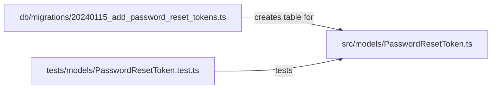

# `/visualize` Skill — Example Interaction

This file shows a realistic example of what the `/visualize` skill should produce
when used in VS Code Copilot Chat. It is a hand-written **golden fixture** — not
generated by an LLM. Use it as a reference when evaluating actual LLM output.

---

## Example Input (what the developer types)

```
@agent-skills /visualize
```

*(The skill reads the current branch's staged/committed diff automatically.
The diff in this example is chapter/password-reset/01-add-schema.)*

Diff summary for context:
- `db/migrations/20240115_add_password_reset_tokens.ts` — new migration (42 lines)
- `src/models/PasswordResetToken.ts` — new model class (38 lines)
- `tests/models/PasswordResetToken.test.ts` — unit tests for the model (55 lines)

---

## Expected Output Shape

The skill should produce:
1. A **Mermaid change map** (≤10 nodes, labeled edges)
2. A **before/after narrative** in plain English (≤5 bullets each side)
3. A **user-visible delta** sentence
4. The complete **PR description block** ready to paste into GitHub

---

## Example Output

---

Here is the PR description for `chapter/password-reset/01-add-schema`:

---

## Chapter 01: Add password reset token schema

### Change Map



### Before / After

**Before this PR:**
- There was no way to store a password reset request in the database.
- The application had no concept of a time-limited, single-use token.

**After this PR:**
- The database has a `password_reset_tokens` table with expiry and single-use tracking.
- A `PasswordResetToken` model provides helpers to create, validate, and invalidate tokens.

**User-visible change:** None — this is a data layer addition; no user-facing feature exists yet.

---

### Checklist
- [x] Change map fits on one screen (3 nodes)
- [x] Before/After is understandable without reading the diff
- [x] Reviewability budget respected (135 lines across 3 files — under 300/5)
- [ ] Tests cover the "After" behavior

---

## Notes on What Makes This Output Good

- The Mermaid diagram is minimal — 3 nodes, not a full call graph
- Edges are labeled with the *relationship*, not just arrows
- Before/After uses behavioral language — no file names, no function names
- User-visible delta correctly says "None" with a brief explanation
- The checklist surfaces the line count and file count so the reviewer can verify the budget
- The skill flags the unchecked test item so the author knows what's still needed
